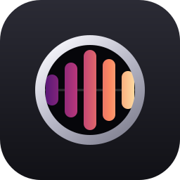
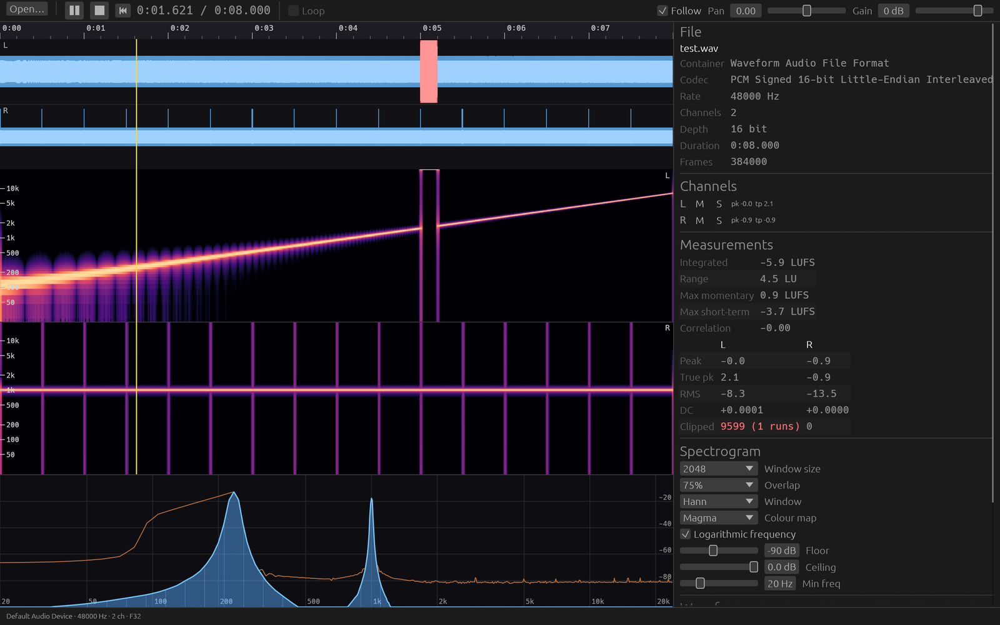

<div align="center">
  

  # Auriscope

  ### An audio player and analyser for Linux and Windows

  *Play a file, and **see** it: waveform, spectrogram and realtime spectrum.*

  [](LICENSE)
  [](https://www.rust-lang.org/)
  [](https://github.com/emilk/egui)
  [](https://github.com/pdeljanov/Symphonia)
  [](#-install)
  

  **[⬇ Download the latest release](https://github.com/frdcmp/auriscope/releases/latest)**
  &nbsp;·&nbsp; Windows `.zip` &nbsp;·&nbsp; Linux `.tar.gz`
</div>

<div align="center">
  
  <sub><i>A synthetic test file: log sweep on the left channel, 1 kHz tone plus impulses on the right, clipped burst at 0:05 flagged in red.</i></sub>
</div>

---

> An auriscope is the instrument a doctor uses to look inside the ear.
> This one is for looking inside the audio.

Auriscope shows three synchronised views of a file: the waveform, a spectrogram of the whole file, and a live spectrum. Underneath sits a playback engine whose audio callback never blocks, never allocates and never takes a lock. It is a player and an analyser, not an editor, so it never writes to your files.

---

## 🚀 Install

**Linux**, one line, no root:

```bash
curl -fsSL https://raw.githubusercontent.com/frdcmp/auriscope/main/install.sh | bash
```

**Windows**, one line, no admin, in PowerShell:

```powershell
irm https://raw.githubusercontent.com/frdcmp/auriscope/main/install.ps1 | iex
```

Both scripts check the release SHA-256 and install for the current user only, into `~/.local` or `%LOCALAPPDATA%\Programs\Auriscope`, with a launcher entry, icons and file associations. **To update, run the same command again.** It does nothing if you already have the newest version.

<details>
<summary><b>Manual download, installer flags and file associations</b></summary>

Every release carries `auriscope-<version>-x86_64-windows.zip` and `auriscope-<version>-x86_64-linux.tar.gz`, each with a `.sha256` beside it. Unpack anywhere and run it. There is nothing to install. Windows will warn that the publisher is unknown, because the binary is not code-signed: choose *More info → Run anyway*. The app checks once a day for a newer release, so a hand-installed copy is not a dead end.

| Flag | What it does |
| :--- | :--- |
| `--git` | Build and install the newest `main` from GitHub. Linux only. |
| `--source` | Build and install the working tree you run it from. Linux only. |
| `--version vX.Y.Z` | Install a specific release. |
| `--force` | Reinstall even if that version is already there. |
| `--uninstall` | Remove everything the script installed. |

Piping leaves no script to pass flags to, so fetch it into a shell or a block first:

```bash
curl -fsSL https://raw.githubusercontent.com/frdcmp/auriscope/main/install.sh | bash -s -- --uninstall
```
```powershell
& ([scriptblock]::Create((irm https://raw.githubusercontent.com/frdcmp/auriscope/main/install.ps1))) -Uninstall
```

To make Auriscope the default for a file type on Linux:

```bash
xdg-mime default io.github.frdcmp.Auriscope.desktop audio/x-wav
```

WAV resolves to more than one MIME type. If a file still opens elsewhere, run `gio info -a standard::content-type yourfile.wav` and claim that string too.

</details>

---

## ✨ Features

| | | |
| :---: | :--- | :--- |
| 🌊 | **Waveform** | Peak and RMS drawn from a multi-resolution pyramid, so a two-hour file zoomed out reads a few thousand cached values instead of millions of samples. Per-channel display, dBFS scale, clipped runs in red, zoom down to the single sample. |
| 🔥 | **Spectrogram** | An STFT of the whole file, ready as soon as analysis finishes. Window size, overlap and function; linear or log frequency; nine palettes; a contrast curve; adjustable dB floor and ceiling. Hovering reads out time, frequency, level and channel. |
| 📈 | **Realtime spectrum** | A separate, cheap FFT over whatever just went to the output device, with averaging and a decaying peak-hold trace. Log axis, matching the spectrogram above it. |
| 📊 | **Delivery checks** | Integrated, short-term and momentary LUFS, loudness range and true peak (EBU R128). Clipped sample counts and run counts. Per channel: sample peak, true peak, RMS, DC offset. Stereo phase correlation. |
| 🎛️ | **A real player** | Sample-accurate click-to-seek, drag-to-select with loop regions, gain and pan, per-channel mute and solo, keyboard navigation. Clicking a channel's name in **Levels** picks it out: drawn full height and played out of both speakers, the way that channel would look and sound imported as a mono file. Whatever you are not hearing is dimmed wherever it appears — waveform, spectrogram and its own strip of meters. Opens by double-click, drag-and-drop, `Ctrl+O` or a command-line argument, and a **Recent** menu beside the Open button reopens the last dozen files. |
| 📸 | **Capture what you see** | The camera beside the settings button saves the waveform, spectrogram and spectrum as a PNG — just the views, without the bars and the sidebar around them — and writes a `.json` of the same name beside it holding everything the side panel says: the file, the WAVE header, Broadcast Wave, tags, markers, loudness, per-channel levels, and the analysis and time range the picture was taken through. `Ctrl+Shift+S`. |
| 🤖 | **A command line** | `auriscope-cli` is the same analysis with no window: `analyze` writes that JSON for any file on stdout, and `render` writes an annotated PNG of the waveform and spectrogram over any time range, with time, frequency and decibel axes drawn around it. For scripts, for a box with no display, and for handing a picture of a file to something that reads pictures. [More below](#-command-line). |
| ⚙️ | **One settings dialog** | `Ctrl+,` holds every view control. Show or hide each pane on its own, and a hidden pane gives its space to the others. Or merge the waveform over the spectrogram in one strip, each with its own opacity. |
| 🗂️ | **A side panel worth reading** | Cards for the file, the WAVE header, Broadcast Wave metadata, tags, cue markers, loudness, per-channel levels, the live analysis parameters and the cursor. |
| 🔒 | **Read-only by design** | Auriscope never writes to your audio. Your settings persist between runs; your files do not change. The list of files you have opened stays on your machine, and Settings → Files switches it off or clears it. |

<details>
<summary><b>How the spectrogram stays sharp when you zoom</b></summary>

The whole-file pass is computed at one hop, so magnifying past a column per pixel would only enlarge blocks. Zooming instead starts a background re-transform of the visible range, at a hop that suits the current zoom, and sampling interpolates rather than peak-picks wherever the view magnifies.

One honest limit: the hop controls how densely the transform is *sampled*, while true time resolution comes from the window length. To separate events closer together than one window, shorten the window.

The last high-resolution tile keeps being drawn while its replacement is computed, and recomputation waits for the view to settle, so the picture never snaps back to the coarse level between wheel notches. Rendering happens on a worker thread, in parallel across pixel columns. Until it lands, the previous image is drawn shifted and stretched to the new view, so a wheel notch costs a frame, not a redraw.

</details>

<details>
<summary><b>Time-frequency reassignment, and why the lines get thin</b></summary>

An ordinary spectrogram paints each bin's energy at the bin's nominal frequency and the frame's nominal time. A steady tone therefore smears across the window's main lobe, and a click smears across every frame that overlaps it.

**Reassignment** computes two extra transforms per frame, against the time-weighted window and the derivative window. Those give, for each bin, where the energy actually sits in time and what frequency it actually has, and the cell is painted there instead. Tones collapse to hairlines and clicks to single columns. Switch it on in Settings. It costs three FFTs per frame instead of one.

Cells more than 70 dB below the frame's peak stay where a plain STFT would put them, because down there the estimates are dominated by leakage and point nowhere useful. Everything else is stored with its *sub-bin position*, one extra byte per cell. Rounding to whole bins would turn a gliding harmonic into a staircase, and smearing it across neighbouring bins would triple the line's width. Keeping the fraction holds lines one bin thin and lets them glide.

**Palettes.** *Amber* is blue in the quiet half and orange above. *Ember* keeps the warmth without the blue, for use over a blue waveform. *Custom* takes three colours of your own over black, with a live preview strip. Magma, Inferno, Viridis, Plasma, Turbo and Grey are there too. The waveform colour is pickable as well, so the two views never have to share a hue.

</details>

---

## 🏛️ Architecture


Three rules shape everything:

1. **The audio callback never blocks.** No locks, no allocation, no file I/O and no logging on that thread. An underrun is an audible click, and clicks in a tool built to hunt for clicks are unacceptable.
2. **Nothing waits on the audio callback either.** If the analysis tap falls behind, the callback drops frames into it rather than waiting for space.
3. **Seeks are generation-stamped.** Every seek bumps an atomic counter. Chunks carry the generation they were made under, and the callback throws away any stale one. That is what makes a seek flush correct without a lock.

<details>
<summary><b>Thread roles, the two analysis paths, memory and seeking</b></summary>

**The decoder** does two jobs. On open it runs a full background pass that builds the pyramid, the spectrogram tiles, the loudness numbers and the clip, DC and correlation statistics, reporting progress so the UI can draw partial results as they arrive. During playback it decodes ahead of the playhead, resamples, maps channels and pushes generation-tagged chunks into the ring.

**The audio callback** copies from the ring, drops stale generations, applies gain and pan, and converts to the device format. It publishes its playhead through an atomic and taps each buffer for the live FFT.

**The UI** owns no audio state. It reads atomics, cached results and the tap ring, then draws. If it stutters, the audio does not.

**Two analysis paths, not one.** The whole-file spectrogram is an offline STFT cached as 8-bit dB columns, max-pooled into coarser levels so that zooming out picks a level rather than recomputing. The realtime spectrum is a separate FFT over the playback tap. Keeping the two apart is what lets the spectrogram be instant. One fed from the tap would fill in only as you listen, which is useless for diagnosis.

**Memory.** The open pass needs every sample once and seeking needs random access, so decoded PCM is cached in RAM as `f32`. The intended design caps this at 2 GB by default, roughly 90 minutes of 48 kHz stereo, and falls back to re-decoding from disk above the cap. That fallback is **not implemented yet**, see the [Roadmap](#-roadmap).

**Seeking depends on the format.** WAV, AIFF and FLAC seek exactly. MP3 and AAC seek to the nearest packet, then decode and discard up to the target sample, honouring encoder delay and padding. You get sample accuracy either way, but the cost differs.

</details>

<details>
<summary><b>Tech stack, and why each crate</b></summary>

| Concern | Crate | Why |
| :--- | :--- | :--- |
| **GUI** | `eframe` / `egui` 0.36 | Immediate-mode, which suits a UI that redraws continuously anyway. One static binary per platform, with no GTK, Qt or webview chain behind it. |
| **Rendering** | `wgpu` via `eframe` | The spectrogram is a GPU texture. Vulkan on Linux, DX12 on Windows, same code. |
| **Decoding** | `symphonia` 0.6 | Pure Rust. WAV, AIFF, CAF, FLAC, ALAC, APE, MP3, AAC, OGG/Vorbis and Matroska, with no FFmpeg to link, audit or ship. |
| **Output** | `cpal` 0.18 | PipeWire and ALSA on Linux, WASAPI on Windows, one API. |
| **FFT** | `realfft` 3.5 | Exploits real-valued input for roughly twice the throughput, which matters when the whole file is transformed on open. |
| **Resampling** | `rubato` 5.0 | High-quality async sinc, for files whose rate does not match the device. |
| **Loudness** | `ebur128` | The reference R128 implementation, run in the same pass as the pyramid. |
| **Thread plumbing** | `rtrb` 0.4 | Lock-free SPSC rings, for both the playback ring and the analysis tap. |
| **Colour maps** | `colorous` plus our own | Amber and Ember are ours. Magma, inferno, viridis, plasma and turbo come from `colorous`. |
| **File dialogs** | `rfd` | Native open dialogs on both platforms. |

**Why egui and not Tauri.** Tauri would mean drawing a spectrogram into a canvas from JavaScript and moving audio frames across the webview boundary sixty times a second. For a tool whose whole job is high-rate custom drawing, that boundary is the wrong place to be.

Text is set in [JetBrains Mono Nerd Font](https://www.nerdfonts.com/), bundled: the proportional cut for labels, the mono cut so numeric columns line up, and its icon glyphs for the card headers. Every size in the app comes from one type scale.

</details>

---

## ⌨️ Keyboard and mouse

| Key | Action | | Gesture | Action |
| :--- | :--- | :-- | :--- | :--- |
| `Space` | Play / pause | | Click | Seek |
| `←` `→` | Seek 5 s (`Shift` for 1 s) | | Drag | Select |
| `Home` `End` | Jump to start / end | | Scroll | Zoom at the pointer |
| `L` | Loop the ruler range | | `Shift`+scroll | Pan |
| `F` / `Shift+F` | Zoom to selection / fit file | | `Alt+Shift`+scroll | Vertical waveform zoom |
| `+` `-` | Zoom in / out | | Middle-drag | Scroll sideways |
| `Esc` | Clear highlight, then range | | Right-click | Clear highlight and range |
| `Ctrl+O` `Ctrl+,` | Open file / settings | | Drag divider | Rebalance panes (double-click resets) |
| `Ctrl+Shift+S` | Save the views as PNG + JSON | | | |

Selection works the way a DAW's does. Dragging highlights a region and also sets a range on the time ruler, shown as a band with a handle at each end. The next click clears the highlight but leaves the range, so you can seek around inside it. The band turns green while looping. Vertical zoom runs from 1x to 4096x, about 72 dB, which is enough to lift a noise floor to full height. At 1x the strip is exactly full scale: 0 dBFS sits on the top edge, with no dead air above it.

---

## 🤖 Command line

The window is one way in. `auriscope-cli` is the other: the same decoding, the same
STFT, the same loudness pass, with nothing on screen.

```bash
# Everything the side panel knows, as JSON on stdout
auriscope-cli analyze take.wav | jq .loudness

# The waveform and spectrogram as a PNG, with axes drawn around them
auriscope-cli render take.wav -o take.png

# A tenth of a second around a suspected edit, at a shorter window
auriscope-cli render take.wav --start 3.44 --end 3.62 --window 1024 -o click.png
```

`analyze` writes the same blocks as the capture sidecar — file, WAVE header, Broadcast
Wave, tags, markers, loudness, per-channel levels — so one reader handles both.

`render` draws a waveform lane and a spectrogram lane per channel. The waveform is on a
**decibel** scale by default rather than a linear one, because that is what makes a noise
floor, a room tone and the gap between two takes visible at all; `--wave-scale linear`
gives the familiar shape back. `--json out.json` writes the report beside the picture
with the framing added: the time range, the frequency range, and what one pixel is worth,
so anything spotted in the image can be turned back into a position in the file.

The axes are the point. A bare spectrogram shows that something happened without saying
when or at what frequency, which is no use to a reader who cannot click on it — a note
weeks later, a batch report, or a model asked what is wrong with a file.

[**docs/CLI.md**](docs/CLI.md) is the full reference: every option, the JSON shape, and the
habits that make the output trustworthy — numbers first, how to pick a window size, and
what an edit seam, a codec ceiling or a digital-silence gap actually look like.

<details>
<summary><b>Options</b></summary>

| Option | |
| :--- | :--- |
| `--start` `--end` | Seconds. Only the visible span is analysed, so a zoomed render of a long file is quick. |
| `--width` `--height` `--wave-height` | Pixels. Height is per lane; `--wave-height 0` or `--no-waveform` drops the waveform. |
| `--channel N` | One channel, counting from 0. The default draws them all, stacked. |
| `--window` `--overlap` `--window-fn` `--reassign` | The STFT, as in the settings dialog. Overlap takes `75`, `75%` or `3/4`. |
| `--db MIN:MAX` `--contrast` `--colormap` | Colour mapping, as in the settings dialog. |
| `--min-hz` `--max-hz` `--linear` | The frequency axis. Logarithmic from 20 Hz by default. |
| `--no-axes` | The bare spectrogram, no margins and no labels, for feeding somewhere else. |
| `--quiet` | No progress on stderr. Errors still go there; JSON only ever goes to stdout. |

Zooming in re-transforms the visible range at one analysis column per pixel column, the
same way the window does, so a short span is as sharp as the window length allows.

</details>

---

## 🗺️ Roadmap

What is left to do.

| | To do |
| :---: | :--- |
| 🧠 | **Large files.** The streaming fallback above the PCM cache cap is not implemented, so every file is decoded fully into RAM. |
| 🎮 | **Spectrogram on the GPU.** It uploads as a texture, but the log-frequency mapping and resampling still happen on the CPU into a viewport-sized image. A shader is the intended end state. |
| 🧵 | **Live spectrum thread.** The realtime FFT runs on the UI thread. One 4096-point real FFT per frame has not been a problem, and it moves off if it ever becomes one. |
| 🪟 | **Windows.** It compiles there in CI, but nobody has heard it. It also still wants an icon resource on the `.exe`, file associations for double-click open, and a winget manifest. |
| 📦 | **Distribution.** The AUR package is written but not published. |
| 🔖 | **A/B markers.** Drop two marks and jump between them. |

---

## 🔨 Building from source

You need a stable Rust toolchain, and `rust-toolchain.toml` pins the exact version. Linux needs ALSA headers and GTK 3 for the file dialog. Windows needs nothing extra.

```bash
sudo pacman -S alsa-lib gtk3                   # Arch
sudo apt install libasound2-dev libgtk-3-dev   # Debian / Ubuntu

cargo run -- path/to/file.flac
```

Debug builds are usable, because `Cargo.toml` compiles dependencies at `opt-level = 3` while keeping your own code at debug settings. Use `--release` for benchmarking and for anything you intend to ship, and expect a few minutes, since that profile uses fat LTO with one codegen unit.

For an edit-and-look loop, [`dev.sh`](dev.sh) rebuilds and restarts on every save — about 1.5 s for a UI change:

```bash
./dev.sh                     # reopens the file you had last
./dev.sh path/to/file.wav
```

Rust has no practical hot reload, so this restarts the process, which costs little: settings and the last file persist, so the app returns to the same file, colour map and zoom. A failed build leaves the running window alone, so you keep the last version that worked on screen while you fix the error. It uses `inotifywait` when `inotify-tools` is installed and otherwise polls, so it needs nothing installed; `cargo watch -x run` does the same job.

<details>
<summary><b>Running the newest <code>main</code>, dev build stamps and Arch packaging</b></summary>

```bash
curl -fsSL .../install.sh | bash -s -- --git    # clone main, build, install
./install.sh --source                           # build YOUR working tree instead
cd packaging/arch/auriscope-git && makepkg -si  # Arch equivalent, managed by pacman
```

`--git` clones into `~/.cache/auriscope-src`, reusing and resetting it on later runs, and always takes the newest commit. A development build says so, through the `git describe` stamp in `--version` and in the About card:

```console
$ auriscope --version
0.1.1                              # a release
0.1.1 (dev v0.1.1-7-g1a2b3c4)      # seven commits past v0.1.1
```

Installing a release over a development build always goes ahead rather than reporting "already current". That is how you get back to a tested version.

</details>

---

## 🧪 Testing

No audio files are committed. The tests synthesise their own signals: a sine that must land in the expected FFT bin at the expected magnitude for every window function, min, max and RMS checked at every pyramid level, a WAV that round-trips through Symphonia sample-exact, an R128 reference tone that must measure −23.0 LUFS within tolerance, and a 44.1 to 48 kHz conversion with the tone frequency and peak level preserved. This forces the analysis code into a library crate the tests can call, which is also what keeps the UI thin.

```bash
cargo test
cargo clippy --all-targets -- -D warnings
```

<details>
<summary><b>Development tools: playback harness, screenshots, spectrogram benchmark</b></summary>

```bash
# Play through the real device for 3 s, seek to 1.5 s mid-play, and report
# playhead progress, tap throughput and underruns. No window.
cargo run --example play -- file.wav 3 1.5

# Capture one frame of the whole window and exit; a `.ppm` path writes the
# raw format instead. This is how the screenshot was made.
AURISCOPE_SCREENSHOT=shot.png cargo run -- file.wav
```

Screenshot variants: `AURISCOPE_SCREENSHOT_ZOOM=1.00,1.06` frames a time range, which exercises the detail-tile path; `AURISCOPE_SCREENSHOT_SETTINGS=1` opens with the settings dialog up, and `=end` scrolls it to the last card; `AURISCOPE_SCREENSHOT_RANGE=0.4,0.9` sets a looped range on the ruler.

```bash
# Time the whole-file STFT, the detail tiles and the viewport render at four
# zoom levels, with and without reassignment.
cargo run --release --example bench_spec -- file.wav 2048 4
AURISCOPE_THREADS=1 cargo run --release --example bench_spec -- file.wav
```

`AURISCOPE_THREADS` caps the worker threads used for tile analysis and rendering anywhere in the app. The harness also checks the parallel tile against the single-threaded one, cell for cell.

</details>

---

## 📦 Packaging

Everything a distribution needs is in the repo: the desktop entry and AppStream metainfo in `assets/`, the recipes under `packaging/`. They all build from a version tag, so **tag first** (`git tag v0.1.0 && git push --tags`), and the release workflow then attaches the Linux and Windows archives. The full step-by-step is in [RELEASING.md](RELEASING.md).

<details>
<summary><b>Update check, Arch and Windows specifics</b></summary>

**Update check.** Builds with the `update-check` feature, on by default and present in the release archives, ask `api.github.com` for the latest release at startup, at most once a day, and show a small *"0.2.0 available"* button in the transport bar. Nothing is downloaded, and nothing about the machine is sent beyond an ordinary HTTPS request. You can turn it off in Settings → About, or skip a version. Distribution packages leave it out (`--no-default-features`), since their package manager is the update channel.

**Arch.** `packaging/arch/auriscope/PKGBUILD` builds the tagged release. `packaging/arch/auriscope-git/PKGBUILD` builds `main` and needs no release and no AUR account. To publish: `updpkgsums`, `makepkg --printsrcinfo > .SRCINFO`, then push to `ssh://aur@aur.archlinux.org/auriscope.git`.

**Windows.** `#![windows_subsystem = "windows"]` hides the console, and the workflow ships a zip. The window and taskbar icon are set at runtime. Still missing: an icon resource on the `.exe`, file associations for double-click open, and a winget manifest.

</details>

---

## ⚖️ Licence

**GPL-3.0-or-later.** Anyone may use it. Anyone who changes it and distributes it must publish their changes under the same terms. See [LICENSE](LICENSE).

The bundled JetBrains Mono Nerd Font (`assets/fonts/`) is © The JetBrains Mono Project Authors under the SIL Open Font License 1.1 (`assets/fonts/OFL.txt`). The Nerd Fonts glyph patch is MIT.

### Open decisions

*   **PCM cache cap.** The 2 GB default and the streaming fallback are not implemented yet.
*   **Plugin hosting.** Whether to ever load CLAP or VST3 analysis plugins. Probably not, since it conflicts with "player, not editor".
*   **Formats beyond Symphonia's set.** Opus and WavPack would need extra crates.
