<div align="center">
  

  # Auriscope

  ### An Audio Player & Analyser for Linux and Windows

  *Play a file, and **see** it — waveform, spectrogram and realtime spectrum, in the spirit of Sound Forge and iZotope RX.*

  [](LICENSE)
  [](https://www.rust-lang.org/)
  [](https://github.com/emilk/egui)
  [](https://github.com/pdeljanov/Symphonia)
  [](#-quick-start)
  
</div>

> An auriscope is the instrument a doctor uses to look inside the ear.
> This one is for looking inside the audio.

---

<div align="center">
  
  <sub><i>A synthetic test file: log sweep on the left channel, 1 kHz tone plus impulses on the right, and a deliberately clipped burst at 0:05 flagged in red.</i></sub>
</div>

---

**Auriscope** opens an audio file and shows you what is actually in it. Three synchronised views — waveform, whole-file spectrogram and realtime spectrum — sit over a playback engine whose audio callback never blocks, never allocates and never takes a lock. It is a **player and analyser, not an editor**: it never modifies your files, which keeps the architecture simple and the tool trustworthy.

---

## ✨ Features

### 🌊 1. Waveform
Peak and RMS envelope drawn from a multi-resolution pyramid, so a two-hour file zoomed all the way out is a read of a few thousand precomputed values rather than a scan of hundreds of millions of samples. Per-channel display, clipped runs highlighted in red, zoom from the whole file down to individual samples.

### 🔥 2. Spectrogram
An STFT heatmap of the **whole file**, available the moment analysis finishes rather than filling in as you listen. Configurable window size, overlap and window function, linear or logarithmic frequency axis, six perceptually uniform colour maps, and adjustable dB floor and ceiling. Hovering reads out time, frequency, level and channel. This is the view you actually diagnose problems in.

### 📈 3. Realtime Spectrum
A separate, much cheaper FFT over whatever just went to the output device, with adjustable averaging and a decaying peak-hold trace. Logarithmic frequency axis matching the spectrogram above it.

### 📊 4. Loudness & Delivery Checks
Everything a deliverable check needs, computed in one pass on open:
*   **Loudness:** integrated, short-term and momentary LUFS, loudness range, and true peak (EBU R128 / ITU-R BS.1770).
*   **Clipping:** clipped sample counts *and* run counts, so a single inter-sample kiss is distinguishable from a crushed passage.
*   **Per channel:** sample peak, true peak, RMS and DC offset.
*   **Stereo:** phase correlation, to catch an inverted or collapsing mix.

### 🎛️ 5. A Real Player
Transport controls, sample-accurate seeking by clicking the waveform, drag-to-select with loop regions, gain and pan, per-channel mute and solo, keyboard-driven navigation, and a clear readout of what the file actually *is* — rate, depth, channels, codec, duration and container tags. Open by double-click, drag-and-drop, `Ctrl+O` or a command-line argument.

### 🔒 6. Read-Only by Design
Destructive editing is explicitly out of scope. Auriscope opens files and never writes to them. Your settings persist between runs; your audio does not change.

---

## 🏛️ Architecture

Three rules shape everything:

1. **The audio callback never blocks.** No locks, no allocation, no file I/O, no logging on that thread. An underrun is an audible click, and clicks in a tool people use to *hunt* for clicks are unacceptable.
2. **Nothing waits on the audio callback either.** If the analysis tap falls behind, the callback drops frames into it. It never waits for space.
3. **Seeks are generation-stamped.** Every seek bumps an atomic counter. Chunks in the playback ring carry the generation they were produced under, and the callback discards any stale one. That is what makes a seek flush correct without a lock.

```mermaid
flowchart TD
    FILE([Audio file]) --> DEC

    DEC[Decoder thread<br/>Symphonia] -->|generation-tagged chunks| RING[[rtrb ring<br/>lock-free SPSC]]
    RING --> RT[Audio callback<br/>realtime, never blocks]
    RT -->|device frames| OUT([cpal to PipeWire / WASAPI])

    RT -.->|tap, drops on full| TAP[[tap ring]]
    TAP --> LIVE[Live FFT<br/>realfft]

    DEC -->|open pass| PYR[Peak / RMS pyramid]
    DEC -->|open pass| STFT[Spectrogram tiles]
    DEC -->|open pass| LOUD[LUFS, true peak<br/>clip, DC, correlation]

    PYR --> UI
    STFT --> UI
    LOUD --> UI
    LIVE --> UI
    RT -.->|playhead atomic| UI[UI thread<br/>egui, ~60 fps]

    UI ==>|play / pause / seek| DEC
    UI ==>|gain, pan, mute| RT

    classDef store fill:#1b1e25,stroke:#3a4150,stroke-width:2px;
    classDef hot fill:#2a1420,stroke:#b6377a,stroke-width:2px;
    class PYR,STFT,LOUD store;
    class RT hot;
```



*   **Decoder** does two jobs. On open it runs a full background pass that builds everything the views need — the peak/RMS pyramid, the spectrogram tiles, the loudness measurements and the clip/DC/correlation statistics — reporting progress so the UI can draw partial results as they arrive. During playback it decodes ahead of the playhead, resamples if needed, maps channels, and pushes generation-tagged chunks into the playback ring.
*   **Audio callback** copies from the ring, drops stale generations, applies gain and pan, converts to the device sample format, and hands frames to the device. It publishes its playhead through an atomic and copies a tap of each buffer out for the live FFT.
*   **Live FFT** consumes that tap and produces the realtime spectrum only. It is *not* the source of the spectrogram.
*   **UI** owns no audio state. It reads atomics, the cached analysis results and the tap ring, and draws. If it stutters, the audio does not.

### 🔀 Two analysis paths, not one

The whole-file **spectrogram** is an offline STFT computed during the open pass and cached as 8-bit dB columns, max-pooled into coarser levels so that zooming out selects a level rather than recomputing. The **realtime spectrum** is a separate FFT over whatever just went to the device. Keeping these apart is what lets the spectrogram be instant and the live view be honest — a spectrogram fed from the playback tap would fill in only as you listen, which is useless for diagnosis.

### 💾 Memory model

The open pass needs every sample once, and playback needs random access for seeking, so decoded PCM is cached in RAM as `f32`. The intended design caps this (default 2 GB, roughly 90 minutes of 48 kHz stereo) and falls back to re-decoding from disk above the cap, keeping only the pyramid, tiles and measurements. A two-hour 96 kHz stereo file is about 5.5 GB as `f32`, so the fallback is not theoretical — but it is **not implemented yet**, see [Known gaps](#known-gaps).

### ⏱️ Seeking is format-dependent

WAV, AIFF and FLAC seek exactly. MP3 and AAC seek to the nearest packet and then decode-and-discard to the target sample, honouring encoder delay and padding from gapless metadata where present. The UI promises sample accuracy and the decoder delivers it, but the cost differs by codec.

---

## 🛠️ Tech Stack

Rust throughout. The choices are deliberate; the reasoning matters more than the versions.

| Concern | Crate | Why |
| :--- | :--- | :--- |
| **GUI** | `eframe` / `egui` 0.36 | Immediate-mode, which suits a UI that redraws continuously anyway. One static binary per platform with no GTK/Qt/webview dependency chain — the single biggest saving on Windows packaging. |
| **Rendering** | `wgpu` via `eframe` | The spectrogram is a GPU texture, not a CPU-blitted image. Vulkan on Linux, DX12 on Windows, same code. |
| **Decoding** | `symphonia` 0.6 | Pure Rust. WAV, AIFF, CAF, FLAC, ALAC, APE, MP3, AAC, OGG/Vorbis and Matroska with no FFmpeg to link, licence-audit or ship. Lossy codecs sit behind feature flags, enabled explicitly in `Cargo.toml`. |
| **Output** | `cpal` 0.18 | PipeWire/ALSA on Linux, WASAPI on Windows, one API. |
| **FFT** | `realfft` 3.5 | Wraps `rustfft` but exploits real-valued input — roughly twice the throughput, which matters when the whole file is transformed on open. |
| **Resampling** | `rubato` 5.0 | High-quality async sinc resampling for files whose rate does not match the output device. |
| **Loudness** | `ebur128` | Reference R128 implementation, run in the same pass as the pyramid. |
| **Thread plumbing** | `rtrb` 0.4 | Lock-free SPSC ring buffers, for both the playback ring and the analysis tap. |
| **Colour maps** | `colorous` | Magma, inferno, viridis, plasma, turbo — perceptually uniform and colourblind-safe. |
| **File dialogs** | `rfd` | Native open dialogs on both platforms. |

> **GUI choice, stated plainly: egui over Tauri.** Tauri would mean drawing a spectrogram into a canvas from JavaScript and moving audio frames across the webview boundary sixty times a second. For a tool whose entire job is high-rate custom drawing, that boundary is the wrong place to be.

---

## 🗺️ Roadmap

| | Milestone | What it contains |
| :---: | :--- | :--- |
| ✅ | **M0 — it builds** | Cargo skeleton, pinned stable toolchain, dependency feature flags, dev-profile optimisation for dependencies, CI building and testing on Linux and Windows. |
| ✅ | **M1 — it plays** | Any Symphonia-decodable file through cpal, transport controls, rate mismatch via Rubato, channel mismatch via a mapping step, generation-stamped seeking, mute/solo, gain and pan. |
| ✅ | **M2 — it draws** | Waveform from the peak/RMS pyramid, clip highlighting, click-to-seek, drag-to-select, wheel pan, pinch and ctrl-wheel zoom, playhead following, drag-and-drop and CLI open. |
| ✅ | **M3 — it analyses** | Offline per-channel spectrogram with max-pooled zoom levels, linear and log frequency axes, hover readout, realtime spectrum with averaging and peak hold, window/overlap/function controls, dB floor and ceiling, perceptual colour maps. |
| ✅ | **M4 — it measures** | Integrated, short-term and momentary LUFS, loudness range, sample and true peak, clipped sample and run counts, DC offset, RMS, stereo correlation, metadata and tag panel, loop regions, keyboard navigation, persisted settings. *Not yet:* A/B markers. |
| ⬜ | **M5 — it ships** | Flathub as `io.github.frdcmp.Auriscope`, AUR, and an MSI or portable `.exe` for Windows via `cargo-dist`. |

### Known gaps

*   **Large files.** The streaming fallback above the PCM cache cap is not implemented: every file is decoded fully into RAM. The 8-bit spectrogram cache also lives in RAM, roughly one byte per STFT cell per channel.
*   **Spectrogram on the GPU.** The spectrogram is uploaded as a texture, but the log-frequency mapping and max-pooling for the visible region are done on the CPU into a viewport-sized image whenever the view changes. A shader doing that sampling is the intended end state.
*   **Live spectrum thread.** The realtime FFT runs on the UI thread from the tap ring, not on its own thread. It is one 4096-point real FFT per frame and has not been a problem; it will move if it ever is.
*   **Untested on Windows.** It compiles there in CI. Nobody has heard it.

---

## 🚀 Quick Start

Requires a stable Rust toolchain — `rust-toolchain.toml` pins the exact version.

### 1. System dependencies

**Linux** needs ALSA development headers, which PipeWire systems still use for the cpal backend, plus GTK 3 for the native file dialog. **Windows** needs nothing extra; WASAPI and DX12 are part of the OS.

```bash
# Arch
sudo pacman -S alsa-lib gtk3
# Debian / Ubuntu
sudo apt install libasound2-dev libgtk-3-dev
```

### 2. Run it

```bash
cargo run -- path/to/file.flac
```

> Debug builds are usable because `Cargo.toml` compiles *dependencies* at `opt-level = 3` while keeping your own code at debug settings. Use `--release` for benchmarking and for anything you intend to ship — expect a few minutes, since the release profile uses fat LTO with a single codegen unit.

### 3. Install the binary

```bash
cargo build --release
install -Dm755 target/release/auriscope ~/.local/bin/auriscope
```

With `~/.local/bin` on your `PATH`, `auriscope file.wav` then works from anywhere.

### 4. Desktop integration (Linux)

Register a desktop entry so Auriscope appears in your launcher and in the "Open With" dialog. The filename **must** match the app ID the window sets, or Wayland will not associate the window with the entry.

```bash
cat > ~/.local/share/applications/io.github.frdcmp.Auriscope.desktop <<'EOF'
[Desktop Entry]
Type=Application
Name=Auriscope
GenericName=Audio Player and Analyser
Comment=Play a file and see it: waveform, spectrogram, spectrum
Exec=/home/YOU/.local/bin/auriscope %f
Icon=io.github.frdcmp.Auriscope
Terminal=false
Categories=AudioVideo;Audio;Player;
MimeType=audio/wav;audio/x-wav;audio/vnd.wave;audio/flac;audio/x-flac;audio/mpeg;audio/mp4;audio/aac;audio/ogg;audio/x-vorbis+ogg;audio/x-aiff;audio/x-caf;audio/x-ape;audio/x-m4a;audio/x-matroska;
EOF

# Icons, from the SVG in this repo
for s in 16 24 32 48 64 128 256 512; do
  rsvg-convert -w $s -h $s assets/io.github.frdcmp.Auriscope.svg \
    -o ~/.local/share/icons/hicolor/${s}x${s}/apps/io.github.frdcmp.Auriscope.png
done
install -Dm644 assets/io.github.frdcmp.Auriscope.svg \
  ~/.local/share/icons/hicolor/scalable/apps/io.github.frdcmp.Auriscope.svg

update-desktop-database ~/.local/share/applications
gtk-update-icon-cache -f -t ~/.local/share/icons/hicolor
```

Use an **absolute path** in `Exec` — the session that launches desktop files does not always inherit `~/.local/bin` on `PATH` — and `%f` rather than `%U`, since the app wants a plain path and not a URI. To make it the default handler for a type:

```bash
xdg-mime default io.github.frdcmp.Auriscope.desktop audio/x-wav
```

> WAV files resolve to more than one MIME type depending on the file. If one still opens elsewhere, check with `gio info -a standard::content-type yourfile.wav` and claim that exact string too.

### ⌨️ Keyboard

| Key | Action |
| :--- | :--- |
| `Space` | Play / pause |
| `←` `→` | Seek ∓5 s (hold `Shift` for 1 s) |
| `Home` `End` | Jump to start / end |
| `L` | Loop the current selection |
| `F` / `Shift+F` | Zoom to selection / fit whole file |
| `+` `-` | Zoom in / out |
| `Esc` | Clear selection and loop |
| `Ctrl+O` | Open a file |

Click the waveform to seek, drag to select, scroll to pan, and pinch or `Ctrl`-scroll to zoom.

---

## 🧪 Testing

No audio files are committed — the tests synthesise their own signals:

*   A sine at a known frequency must land in the **expected FFT bin at the expected magnitude**, for every supported window function.
*   A synthetic ramp validates **min/max/RMS at every pyramid level**.
*   A generated WAV **round-trips through Symphonia sample-exact**.
*   An EBU R128 reference tone must measure **−23.0 LUFS within tolerance**.
*   The resampling feeder must convert 44.1 → 48 kHz with the tone frequency and peak level preserved, with no audio device involved.

This forces the analysis code to live in a library crate the tests can call, which is also what keeps the UI thin.

```bash
cargo test
cargo clippy --all-targets -- -D warnings
```

Two development tools exercise what unit tests cannot reach:

```bash
# Decode, play through the real device for 3 s, seek to 1.5 s mid-play, and
# report playhead progress, tap throughput and underruns. No window.
cargo run --example play -- file.wav 3 1.5

# Open a file, wait for analysis, start playback, capture one frame to PPM
# and exit. This is how the screenshot above was made.
AURISCOPE_SCREENSHOT=shot.ppm cargo run -- file.wav
```

---

## 📦 Packaging notes

*   **Flathub** requires an app ID under a domain you control. `auriscope.com` is not ours, so the ID is `io.github.frdcmp.Auriscope`. Still needs a metainfo file and offline cargo sources generated with `flatpak-cargo-generator`.
*   **Windows** already sets `#![windows_subsystem = "windows"]` to hide the console; it still needs an icon resource and optional file associations for double-click open.
*   **CI** builds and tests on `ubuntu-latest` and `windows-latest` on every push, so the platform you are not sitting at cannot rot silently.

---

## ⚖️ Licence

**GPL-3.0-or-later.** Anyone may use it. Anyone who changes it and distributes it must publish their changes under the same terms. See [LICENSE](LICENSE).

## 🤔 Open decisions

*   **PCM cache cap** — 2 GB default described above; the cap and the streaming fallback are not implemented yet.
*   **Plugin hosting** — whether to ever load CLAP/VST3 for analysis plugins. Probably not; it conflicts with "player, not editor".
*   **File formats beyond Symphonia's set** — Opus and WavPack would need additional crates.
